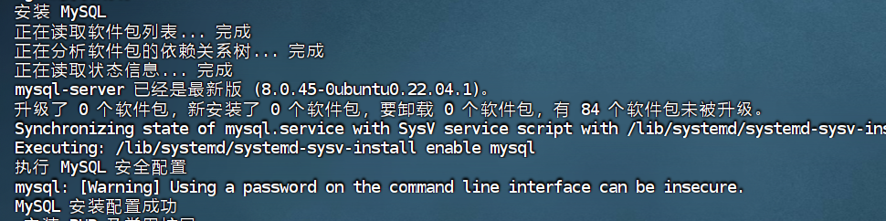

# lnmp-auto-install-
一键安装 LNMP 环境 (Nginx + MySQL + PHP) 的 Shell 脚本                                   
一个用于 Ubuntu 20.04/22.04 的 Shell 脚本，可以自动安装 Nginx、MySQL、PHP 并完成基本配置。

## 功能
 - 自动安装 Nginx，开放 80 端口
 - 自动安装 MySQL 并设置 root 密码
 - 自动安装 PHP-FPM 及常用扩展
 - 自动配置 Nginx 支持 PHP
 - 创建 PHP 信息测试页面

 ## 环境要求
- Ubuntu 20.04 或 22.04
- 具有 sudo 权限的用户

## 使用方法
1. 克隆本仓库：
   git clone git@github.com:你的用户名/lnmp-auto-install.git
   cd lnmp-auto-install
2. 给脚本添加权限
    chmod +x install.sh
3. 运行脚本
    ./install.sh
4. 等待安装完成，访问 http://你的服务器IP/info.php 查看 PHP 信息。

### 5. 运行截图
以下是脚本执行后的效果截图：

### 7. 注意事项
注意事项:
默认 MySQL root 密码为 your_password，建议修改。
如果防火墙未启用，脚本会跳过防火墙配置，请手动开放 80 端口。