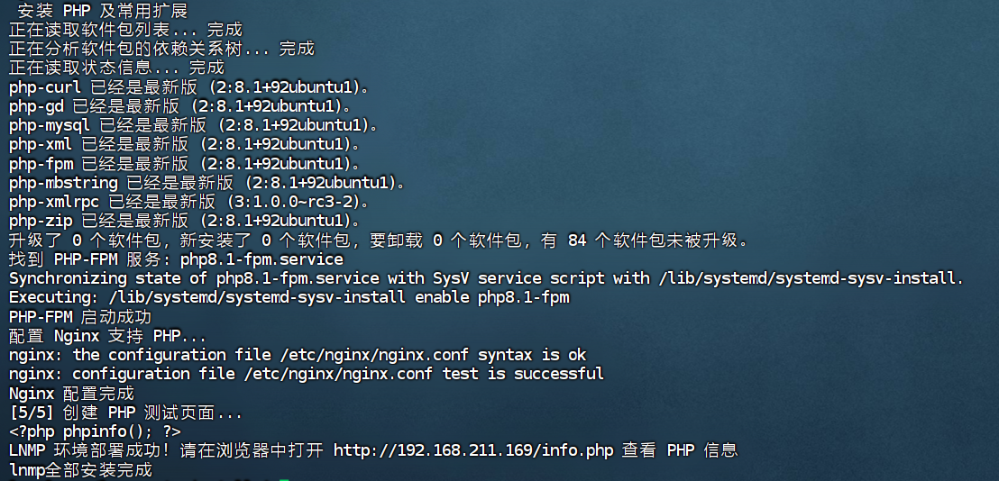
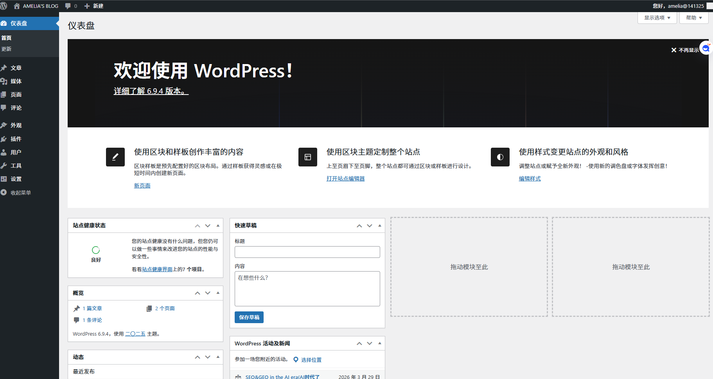
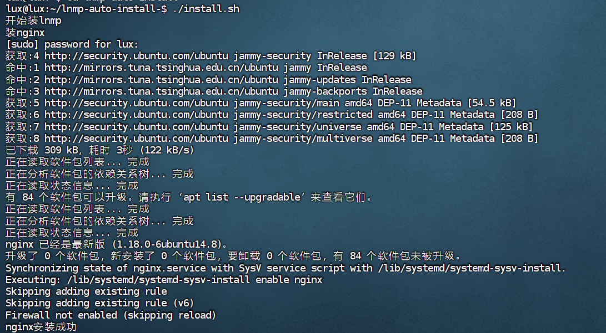

# LNMP 环境一键安装 + WordPress 手动部署

[]()
[]()
[]()
[]()

面向运维初学者的 LNMP 环境部署实践项目，提供自动化安装脚本与 WordPress 手动部署全流程指南，覆盖环境搭建、应用部署、常见问题处理等核心场景，可直接用于学习或测试环境快速搭建。

---

## 技术栈

- **操作系统**：Ubuntu 20.04 / 22.04 (LTS)
- **Web 服务**：Nginx 1.18+
- **数据库**：MySQL 8.0
- **运行环境**：PHP 8.1 + PHP-FPM
- **应用程序**：WordPress 最新中文版
- **工具链**：Git、Shell Script

---

##  快速开始

### 1. 克隆仓库
```bash
git clone git@github.com:你的用户名/lnmp-auto-install.git
cd lnmp-auto-install
```

### 2. LNMP 一键安装
```bash
chmod +x install.sh
sudo ./install.sh          # 自动安装 Nginx, MySQL, PHP 及依赖扩展
```
安装完成后访问 `http://服务器IP/info.php` 验证环境（显示 PHP 信息页面即部署成功）。

### 3. WordPress 手动部署
核心步骤：创建数据库 → 下载解压程序 → 配置文件权限 → 配置数据库连接 → Nginx 伪静态 → 浏览器完成安装。
完整操作见下方「核心实现」章节。

---

##  核心实现

### 1. LNMP 一键安装脚本（install.sh）
脚本实现全自动化环境部署，核心逻辑如下：
- 系统软件源更新与依赖预处理
- Nginx 安装、80端口开放（适配 ufw 防火墙）
- MySQL 8.0 安装与 root 密码初始化（默认密码：your_password，建议部署后立即修改）
- PHP 8.1 及核心扩展安装（php-fpm/php-mysql/php-curl/php-gd/php-xml/php-mbstring）
- Nginx 默认站点配置优化（启用 index.php 优先级、配置 PHP 解析规则）
- 服务自启配置（Nginx/PHP-FPM/MySQL）
- 环境测试文件生成（info.php）

### 2. WordPress 手动部署全流程

#### 2.1 数据库准备
```bash
mysql -u root -p
# 执行以下 SQL 语句（替换密码为自定义强密码）
CREATE DATABASE wordpress DEFAULT CHARACTER SET utf8mb4 COLLATE utf8mb4_unicode_ci;
CREATE USER 'wpuser'@'localhost' IDENTIFIED BY 'your_strong_password';
GRANT ALL PRIVILEGES ON wordpress.* TO 'wpuser'@'localhost';
FLUSH PRIVILEGES;
EXIT;
```

#### 2.2 程序文件部署
```bash
# 下载并解压 WordPress 中文版
cd /tmp
wget https://cn.wordpress.org/latest-zh_CN.tar.gz
tar -xzf latest-zh_CN.tar.gz

# 部署至网站根目录（先备份原有文件）
sudo mv /var/www/html /var/www/html_backup
sudo mkdir -p /var/www/html
sudo cp -r wordpress/* /var/www/html/
```

#### 2.3 文件权限配置
```bash
# 确认 PHP-FPM 运行用户（默认 www-data）
ps aux | grep php-fpm | head -n 2

# 设置目录/文件权限
sudo chown -R www-data:www-data /var/www/html
find /var/www/html -type d -exec chmod 755 {} \;
find /var/www/html -type f -exec chmod 644 {} \;
```

#### 2.4 数据库连接配置
```bash
cd /var/www/html
sudo cp wp-config-sample.php wp-config.php
sudo nano wp-config.php
```
修改数据库连接参数：
```php
define( 'DB_NAME', 'wordpress' );
define( 'DB_USER', 'wpuser' );
define( 'DB_PASSWORD', 'your_strong_password' );
define( 'DB_HOST', 'localhost' );
define( 'DB_CHARSET', 'utf8mb4' );
define( 'DB_COLLATE', 'utf8mb4_unicode_ci' );
```

#### 2.5 Nginx 伪静态配置
编辑默认站点配置文件：
```bash
sudo nano /etc/nginx/sites-enabled/default
```
在 `location / {}` 块中替换为以下规则（解决 WordPress 固定链接问题）：
```nginx
location / {
    try_files $uri $uri/ /index.php?$args;
    index index.php index.html index.htm;
}
```
验证配置并重启服务：
```bash
sudo nginx -t
sudo systemctl reload nginx
```

#### 2.6 完成安装
访问 `http://服务器IP`，按页面提示填写站点名称、管理员账号、密码，点击「安装 WordPress」即可完成部署。
后台管理地址：`http://服务器IP/wp-admin`

### 3. 常见问题处理
| 问题现象 | 根因分析 | 解决方案 |
|----------|----------|----------|
| Nginx 配置测试报错："try_files" 重复 | 默认配置中已存在 try_files 指令 | 删除多余行，仅保留 `try_files $uri $uri/ /index.php?$args;` |
| 访问站点显示 403 Forbidden | Nginx 索引文件未包含 index.php | 在 Nginx 配置的 `index` 指令中添加 `index.php` |
| 数据库连接失败 | wp-config.php 密码与 MySQL 配置不一致 | 核对并更新 wp-config.php 中的数据库密码 |
| PHP 页面空白/500 错误 | PHP-FPM 未运行或配置异常 | 启动 PHP-FPM：`sudo systemctl start php8.1-fpm`，检查日志：`journalctl -u php8.1-fpm` |

---

## 📸 部署效果

| LNMP 环境验证页面 | WordPress 后台管理 |
|-------------------|------------------|
|  |  |
| WordPress 前台展示 | 脚本执行过程 |
|  |  |

---

## 📁 项目结构

```
lnmp-auto-install/
├── README.md                # 项目文档
├── install.sh               # LNMP 一键安装脚本
├── screen/                  # 部署效果截图
└── configs/                 # 参考配置文件（脱敏）
    ├── nginx-default.conf   # Nginx 示例配置
    └── wp-config-sample.php # WordPress 配置示例
```

---

## 📬 说明

本项目为运维学习实践所用，仅适用于测试环境，生产环境部署需补充安全加固（如 MySQL 密码策略、Nginx 安全配置、PHP 权限限制等）。

如需反馈问题，可提交 Issue 或发送邮件至：lux77769@gmail.com
